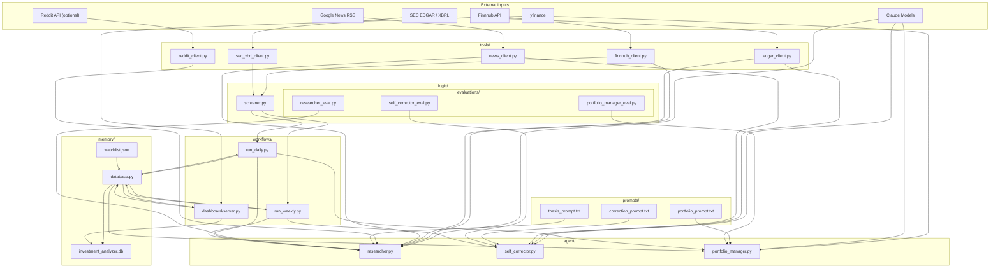
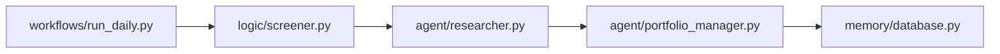
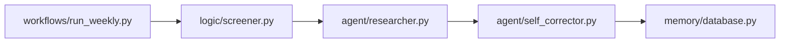
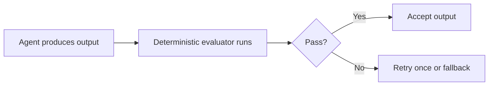

# Architecture

This document describes the current high-level architecture of the Investment Analyzer project.

## System Overview



## Folder Responsibilities

- `agent/`
  - LLM-driven reasoning and decision modules.

- `logic/`
  - Deterministic domain logic such as ranking, validation, and evaluation.

- `logic/evaluations/`
  - Deterministic quality checks for agent outputs.
  - These modules decide whether output is acceptable, should be retried, or should degrade to fallback behavior.

- `tools/`
  - Provider-specific adapters and low-level fetchers.

- `workflows/`
  - Orchestration entrypoints that sequence tools, logic, agents, and persistence.

- `memory/`
  - Persistent state and storage.

- `prompts/`
  - Prompt templates used by LLM-based agents.

## Daily Workflow



### Daily Flow Notes

- `run_daily.py` loads the active watchlist from SQLite-backed memory.
- The screener ranks candidates using deterministic factors from Finnhub and SEC XBRL.
- The researcher generates structured thesis output for non-held names.
- The portfolio manager uses Claude to propose buys and sells, then applies deterministic validation.
- Portfolio state, trades, and snapshots are persisted through `memory/database.py`.

## Weekly Workflow



### Weekly Flow Notes

- `run_weekly.py` screens the watchlist and researches the shortlisted names.
- `self_corrector.py` compares current outputs against prior snapshots and logs thesis drift.
- Corrections and updated snapshots are written back to SQLite.

## Evaluation Layer

The evaluation layer exists to reduce the risk of low-quality LLM outputs inside orchestrated workflows.

Current evaluation modules:

- `logic/evaluations/researcher_eval.py`
  - checks researcher output shape and minimum content quality

- `logic/evaluations/self_corrector_eval.py`
  - checks correction output validity and required fields

- `logic/evaluations/portfolio_manager_eval.py`
  - checks trade-decision schema and minimum structural quality

### Evaluation Pattern



The evaluators belong in `logic/evaluations/` because they are deterministic policy and quality-control code, not LLM agents themselves.

## Data Flow Summary

- External providers feed data into `tools/`.
- `logic/` turns raw provider data into deterministic scores and validations.
- `agent/` uses prompts plus external context to produce LLM-driven decisions.
- `workflows/` coordinate when each step runs and what happens after each result.
- `memory/` persists outputs and state so the dashboard and future workflows can inspect history.

## Entrypoints

```bash
python3 -m memory.database
python3 -m workflows.run_daily --force
python3 -m workflows.run_weekly
python3 -m workflows.dashboard.server
```
